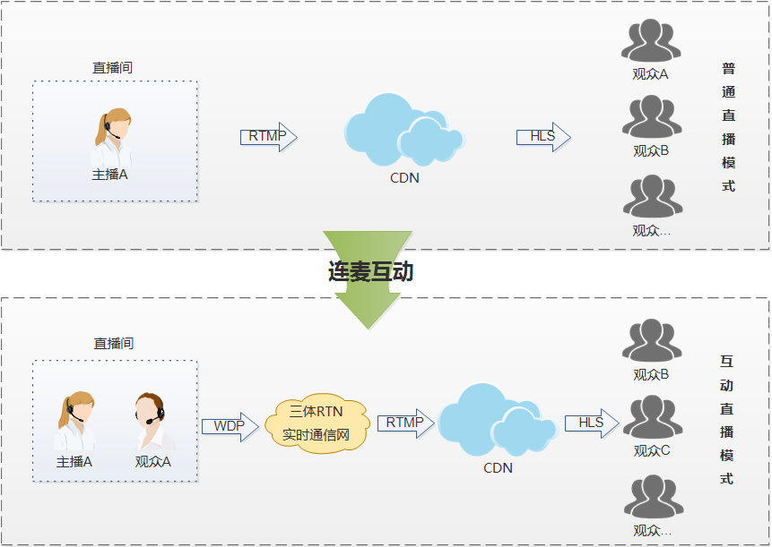
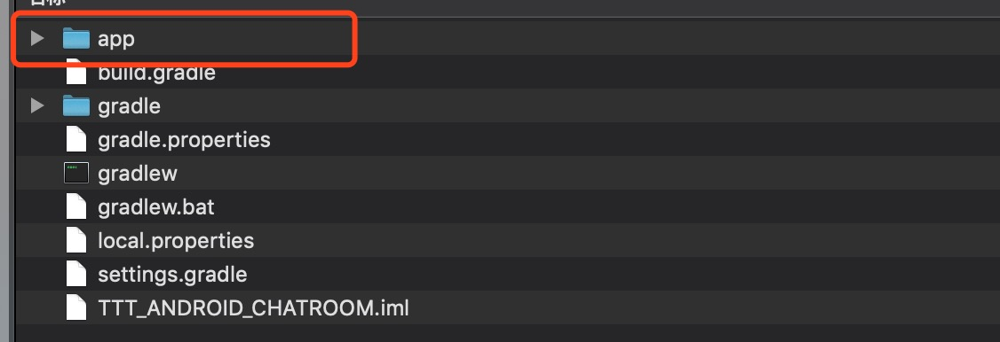

# 单向直播转互动直播
随着移动互联网技术的发展，网络直播作为新兴的社交方式已引发新一轮媒介革命，迅速成为新媒体营销的新阵地，如何在直播竞争中取得领先优势，成为各个平台寻求差异化的动力，“互动直播”成为了直播发展的趋势。通过视频连麦，用户之间可以进行视频互动，达到更深层次的超越语言文字的交流。
互动直播对比传统单向直播，可以演变更多的互动玩法，大幅提升直播的趣味性与娱乐性。

## 典型场景
互动直播与单向直播不同，赋予了普通观众“露脸发声”的权利，低延时的通信网络，主播可以实现与连麦观众的双向互动，在直播房间里的其他观众也可以观看主播和连麦观众互动的过程。在互动的时候还可以加上道具、美颜等滤镜，与陌生人进行视频互动聊天，是社交娱乐的典型场景。
基于三体云的互动直播技术，可以将原来的传统单向直播快速转变为互动直播场景，通过技术深度优化实现传统直播转换到互动连麦场景下的无缝切换。

# 方案设计

观众通过CDN观看直播时，可以申请上麦，加入直播间与主播实时互动连线。

# 示例程序

#### 准备工作
1. 在三体云官网SDK下载页 [http://3ttech.cn/index.php?menu=53](http://3ttech.cn/index.php?menu=53) 下载对应平台的 连麦直播SDK。
2. 登录三体云官网 [http://dashboard.3ttech.cn/index/login](http://dashboard.3ttech.cn/index/login) 注册体验账号，进入控制台新建自己的应用并获取APPID。
3. 下载DEMO源码，将APPID填入代码中相应的位置并体验效果。

# 实现步骤

### 直推

1. 创建 TTT 音视频引擎对象 [create](http://www.3ttech.cn/index.php?menu=72&type=Android#create)
2. 设置视频参数 [setVideoProfile](http://www.3ttech.cn/index.php?menu=72&type=Android#setVideoProfile)
3. 启动本地视频预览 [startPreview](http://www.3ttech.cn/index.php?menu=72&type=Android#startPreview)
4. 设置本地视频显示属性 [setupLocalVideo](http://www.3ttech.cn/index.php?menu=72&type=Android#setupLocalVideo)
5. 开始rtmp推流 [startRtmpPublish](http://www.3ttech.cn/index.php?menu=72&type=Android#startRtmpPublish)
6. 停止rtmp推流 [stopRtmpPublish](http://www.3ttech.cn/index.php?menu=72&type=Android#stopRtmpPublish)

### 上麦(加入房间推流)
1. 设置频道模式，PK 场景下频道模式需要设定为直播模式 [setChannelProfile](http://www.3ttech.cn/index.php?menu=72&type=Android#setChannelProfile)
2. 设置用户角色[setClientRole](http://www.3ttech.cn/index.php?menu=72&type=Android#setClientRole)
3. 设置编码格式AAC [setPreferAudioCodec](http://www.3ttech.cn/index.php?menu=72&type=Android#setPreferAudioCodec) 
4. 设置 SDK 的 CDN 推流地址 [configPublisher](http://www.3ttech.cn/index.php?menu=72&type=Android#configPublisher)
5. 加入频道 [joinChannel](http://www.3ttech.cn/index.php?menu=72&type=Android#joinChannel)
6. 设置远端视频显示属性 [setupRemoteVideo](http://www.3ttech.cn/index.php?menu=72&type=Android#setupRemoteVideo)
7. 离开频道 [leaveChannel](http://www.3ttech.cn/index.php?menu=72&type=Android#leaveChannel)

### IjkVideoView 拉流控件必要接口
1. 创建 ijk 拉流控件 [CreateIjkRendererView](http://www.3ttech.cn/index.php?menu=72&type=Android#CreateIjkRendererView)
2. 开始rtmp拉流 [startIjkPlayer](http://www.3ttech.cn/index.php?menu=72&type=Android#startIjkPlayer)
3. 停止rtmp拉流 [stopIjkPlayer](http://www.3ttech.cn/index.php?menu=72&type=Android#stopIjkPlayer)

#### 可选操作
1. 翻转摄像头 [switchCamera](http://www.3ttech.cn/index.php?menu=72&type=Android#switchCamera) 

#### ps

1. 上麦之后等待TTT服务 [onRtcPushStatus](http://www.3ttech.cn/index.php?menu=72&type=Android#onRtcPushStatus)  回调线上服务推流成功才停止rtmp直推
2. 下麦需要等直推 [onStatusOfRtmpPublish](http://www.3ttech.cn/index.php?menu=72&type=Android#onStatusOfRtmpPublish) 成功才离开房间
3. 推流地址**最后一位数字**大的会取代小的，拉流地址不包含**?**及后面的部分
4. 拉流部分可以参考demo，也可使用其它三方拉流

### Android 工程配置

1. 解压下载的 SDK 压缩包，内容如图所示

2. 用Android Studio，打开 **Android-KTV Demo** 工程，文件列表如图所示，复制 **3T\_Native\_SDK\_for\_Android\_Vx.x.x\_Full.aar** 到工程 **app** 项目下的 **libs** 目录下。
 
 
3. 引用 aar 包。在 app 项目下的 build.gradle 文件中添加红框中相应代码来引用。
 
 
 

4. 将申请到的 **APPID** 填入 SDK 的初始化函数 **create** 中，如下图所示。

5. 最后编码代码即可运行Demo。

	运行环境:
    * Android Studio 3.0 +
    * minSdkVersion 16
    * gradle 4.6
    * java 7.0

	Android权限要求:
	
	  * **android.permission.CAMERA** ---> SDK视频模块需要使用此权限用来访问相机，用于获取本地视频数据。
     * **android.permission.RECORD_AUDIO** ---> SDK音频模块需要使用此权限用来访问麦克风，用于获取本地音频数据。
     * **android.permission.INTERNET** ---> SDK的直播和通讯功能，均需要使用网络进行上传。
     * **android.permission.BLUETOOTH** ---> SDK的直播和通讯功能，均需要访问蓝牙权限，保证用户能正常使用蓝牙耳机。
     * **android.permission.BLUETOOTH_ADMIN** ---> 蓝牙权限。
     * **android.permission.MODIFY\_AUDIO\_SETTINGS** ---> SDK的直播和通讯功能，均需要访问音频路由，保证能正常切换听筒，扬声器，耳机等路由切换。
     * **android.permission.ACCESS\_NETWORK\_STATE** ---> SDK的直播和通讯功能，均需要访问网络状态。
     * **android.permission.READ\_PHONE\_STATE** ---> SDK的直播和通讯功能，均需要访问手机通话状态。

# 常见问题
1. 由于部分模拟器会存在功能缺失或者性能问题，所以 SDK 不支持模拟器的使用。

